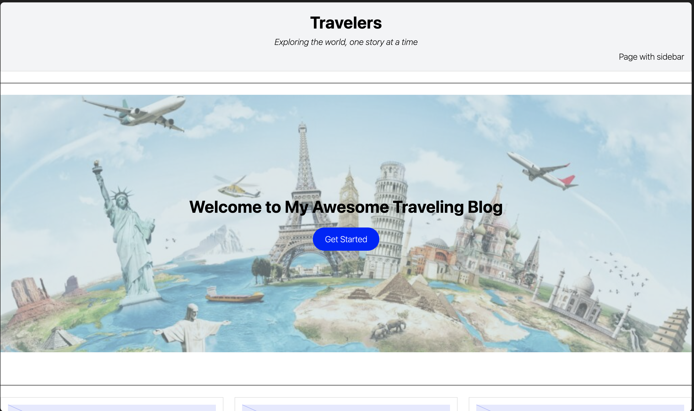

# My First Block Theme

A simple WordPress block theme built as a learning project.  
It includes a custom color palette, typography settings, reusable block patterns, and template parts for header and footer.

---

## Installation

1. Download or clone this theme folder into your WordPress install at:

wp-content/themes/my-first-block-theme

2. In the WordPress dashboard, go to **Appearance → Themes**.
3. Activate **My First Block Theme**.
4. Open the Site Editor (**Appearance → Editor**) to customize templates or global styles.

---

## Templates Included

- `home.html` – Blog index displaying hero and posts in a grid with title, and excerpt.
- `single.html` – Single post layout with featured image, title, content, and author info.
- `page.html` – Page layout with navigation sidebar.
- `archive.html` – List of posts in an archive layout.
- `404.html` – Custom 404 error page with message + search block.
- `index.html` – For the theme to work, with no other function.

### Template Parts

- `parts/header.html` – Full-width site header with tagline and navigation.
- `parts/footer.html` – Full-width footer with year, site info, and social links.
- `parts/sidebar.html` –  Functional sidebar search bar for posts.

### Patterns

- `patterns/call-to-action.php` – A section with heading, text, and button for use in pages.
- `patterns/hero.php` - Main section for home screen, displaying a welcome with a button.
- `patterns/team-section.php` – Three-column layout with image, name, and role for team members.
- `patterns/two-columns.php` - Functional and simple two columns for media.

### Styles

- `styles/light.json` - Light theme
- `styles/dark.json` - Dark theme

---

## Screenshot

Below is a preview of the theme running inside the WordPress editor:

